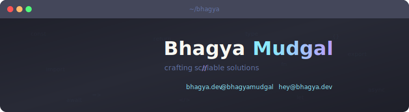

<p align="center">
  
</p>

```bash
❯ whoami
  Bhagya Mudgal — Technical Lead @ GastroSmart
  Full-stack developer, Web3 builder, clean code advocate

❯ cat stack.json | jq '.current'
  {
    "languages"  : ["TypeScript"],
    "frontend"   : ["Next.js", "React", "Tailwind CSS"],
    "backend"    : ["Node.js", "Hono", "NestJS"],
    "blockchain" : ["Solana"],
    "tools"      : ["Drizzle", "Turborepo", "Docker", "Vercel"]
  }

❯ ls ~/projects --featured
  dbmux            → Open-source CLI for PostgreSQL backup/restore

❯ curl -s bhagya.dev/links | jq
  {
    "portfolio" : "bhagya.dev",
    "twitter"   : "@bhagyamudgal",
    "linkedin"  : "in/bhagyamudgal",
    "email"     : "hey@bhagya.dev"
  }
```

<p>
  <a href="https://bhagya.dev">bhagya.dev</a> · <a href="https://x.com/bhagyamudgal">X</a> · <a href="https://www.linkedin.com/in/bhagyamudgal/">LinkedIn</a> · <a href="mailto:hey@bhagya.dev">Email</a>
</p>

---

<p>
  
</p>

<p>
  
</p>

<p>
  
</p>

---

```bash
$ echo "Thanks for stopping by!"
```

<span></span>
<a href="https://github.com/bhagyamudgal?tab=followers"></a>
